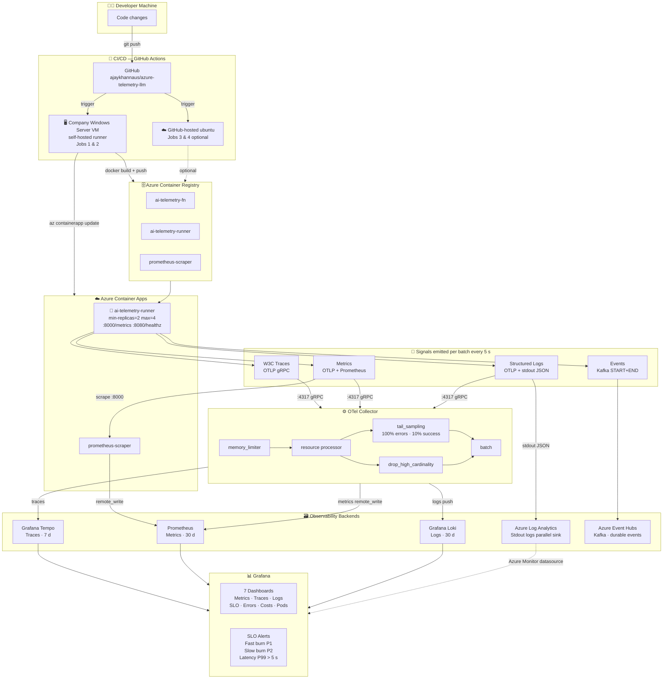
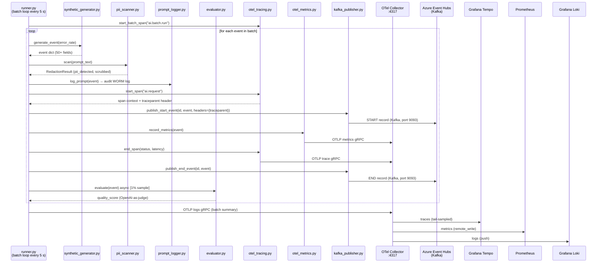
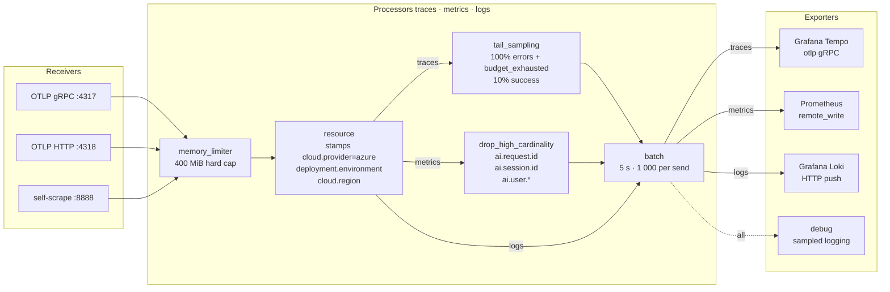
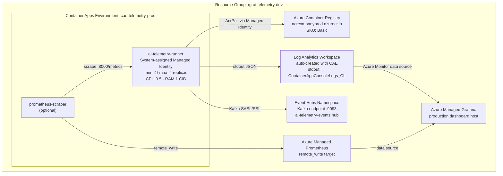
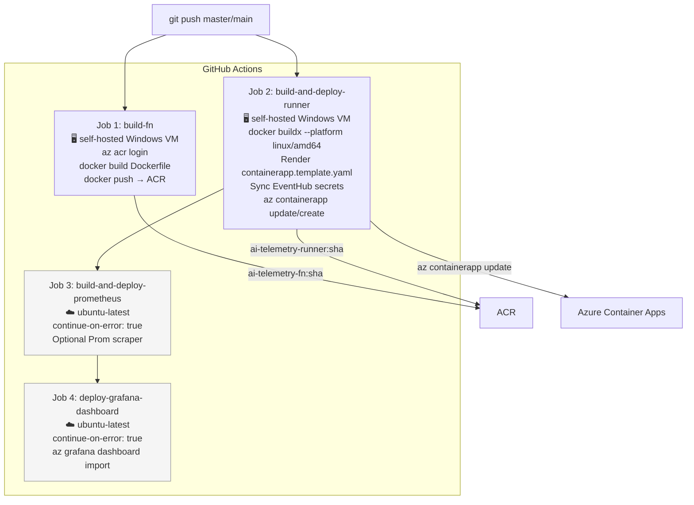
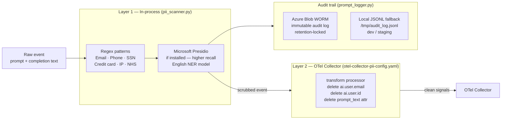

# Architecture — AI Gateway Telemetry

## 1. System Overview



---

## 2. Signal Flow (Detailed)



---

## 3. OTel Span Tree (per request)

```
ai.batch.run  [parent span — entire 5-s batch]
└── ai.request  [one per LLM call]
    ├── ai.publish.start   [Kafka START event]
    ├── ai.latency.ttft    [time-to-first-token phase]
    ├── ai.latency.gen     [generation phase]
    ├── ai.latency.total   [full end-to-end]
    └── ai.publish.end     [Kafka END event]

W3C traceparent propagated into every Kafka message header
→ downstream consumers can continue the same trace
```

---

## 4. OTel Collector Pipeline



---

## 5. Azure Infrastructure



---

## 6. CI/CD Pipeline



---

## 7. Security & PII Layers



---

## 8. Generator Modules

| Module | Role |
|---|---|
| `synthetic_generator.py` | Generates 50-field LLM event dicts (model, tokens, cost, latency, errors) |
| `kafka_publisher.py` | Publishes START+END pairs to Event Hubs over Kafka protocol with W3C traceparent |
| `otel_tracing.py` | W3C span tree: `ai.batch.run` → `ai.request` → 5 child spans |
| `otel_metrics.py` | 6 OTel instruments + Prometheus exporter on :8000/metrics |
| `otel_logging.py` | OTLP log export (structured JSON to Loki via Collector) |
| `azure_logger.py` | Structured JSON to stdout → Log Analytics (parallel Azure sink) |
| `pii_scanner.py` | In-process PII redaction (regex + optional Presidio) before any emit |
| `prompt_logger.py` | Append-only audit log of every prompt (WORM Blob / local JSONL) |
| `evaluator.py` | OpenAI-as-judge quality scoring — async, 1% sample, token-budgeted |
| `pod_metrics_simulator.py` | Simulated kube-state-metrics (pod phase, resource pressure) |
| `health_server.py` | HTTP :8080/healthz and /readyz for Container App liveness probes |
| `runner.py` | Main batch loop — orchestrates all modules every 5 s |

---

## 9. Local Dev Stack (docker-compose.observability.yml)

```
docker compose -f docker-compose.observability.yml up -d

localhost:3000  →  Grafana        (admin/admin)
localhost:9090  →  Prometheus     (query UI)
localhost:3200  →  Grafana Tempo  (trace search)
localhost:3100  →  Grafana Loki   (log query)
localhost:4317  →  OTel Collector (OTLP gRPC receiver)
localhost:4318  →  OTel Collector (OTLP HTTP receiver)
localhost:8888  →  Collector self-metrics
```
