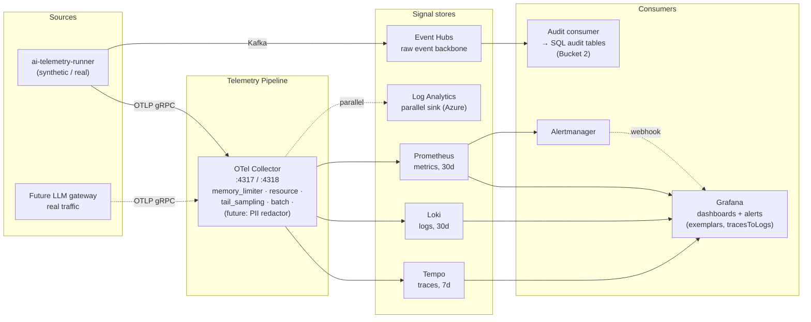

# AI Observability Platform — Improvement Plan

**Status:** Planning · v1.0
**Sources:**
- `AI_Observability_Requirements_Specification_78c6.pdf` (Phase 1 / Phase 2 / OOS / NTC)
- [`RRastogi1981/observability`](https://github.com/RRastogi1981/observability) reference architecture (OTel Collector → Tempo / Loki / Prometheus → Grafana)
- Current repo state (`master` + `cursor/prod-hardening-b58f`)

This document inventories what we have today, lays out the gaps against the spec and the reference architecture, and proposes a sequenced delivery plan. It is intentionally implementation-light — no code is changed by this document.

---

## 1. Where we are today

| Capability | Status | Where |
|---|---|---|
| Synthetic LLM event generator | Implemented | `generator/synthetic_generator.py` |
| Event Hubs publisher (Kafka, idempotent, fail-fast) | Implemented | `generator/kafka_publisher.py` |
| OTel metrics (5 instruments: requests, duration, tokens, cost, errors) | Implemented | `generator/otel_metrics.py` |
| Structured JSON logs → Log Analytics | Implemented | `generator/azure_logger.py` |
| Health / readiness probes (`/healthz`, `/readyz`) | Implemented | `generator/health_server.py` |
| Synthetic kube-state-metrics / node-exporter / cAdvisor | Implemented | `generator/pod_metrics_simulator.py` |
| Prometheus scraper + remote-write | Implemented | `Dockerfile.prometheus`, `prometheus.yml` |
| Container Apps HA (minReplicas=2 + probes) | Implemented | `infra/containerapp.template.yaml` |
| Grafana dashboard (single dashboard) | Implemented | `dashboards/grafana_dashboard.json` |
| Recording rule + 2 alerts | Implemented | `rules.yml` |
| Lint + pytest + validation CI gate | Implemented | `.github/workflows/deploy.yml` |
| **Distributed tracing** | **Missing** | — |
| **Prompt / response logging** | **Missing** | — |
| **OTel Collector** (central pipeline) | **Missing** | — |
| **Log / trace store as code** (Loki / Tempo) | **Missing** | — |
| **PII detection, toxicity, prompt-injection** | **Missing** | — |
| **Real anomaly detection** (we only inject) | **Missing** | — |
| **SLO + burn rate alerts** | **Missing** | — |
| **Immutable audit trail** | **Missing** | — |
| **Tenant isolation** | **Missing** | — |
| **Agent / tool / RAG span model** | **Missing** | — |
| **Self-observability of the platform** (NFR-014) | **Missing** | — |
| **Multi-cloud deployment option** | **Missing** | — |

---

## 2. Gap analysis vs the AI Observability Spec

### 2.1 Phase 1 functional gaps

| FR | Capability | Status | Notes |
|---|---|---|---|
| FR-001 | Telemetry ingestion (OTel) | **Partial** | We emit OTel metrics; we don't emit OTel traces or OTel logs (logs are stdout-JSON). |
| FR-002 | Distributed tracing | **Missing** | No spans, no `traceparent` propagation, no trace backend. This is the most impactful gap. |
| FR-003 | Prompt logging | **Missing** | We log request metadata but not the actual prompt / response text. Needs encryption + PII handling. |
| FR-004 | Token monitoring | **Done** | Per-model counters, plus per-event token fields on the Event Hub payload. |
| FR-005 | Latency monitoring | **Partial** | We have a single `latency_ms`; spec asks for end-to-end, **first-token**, **queue delay** separately. |
| FR-009 | Audit logging (immutable) | **Partial** | Logs land in Log Analytics, which is append-only but not WORM. No SIEM forwarder. |
| FR-011 | Dashboarding | **Partial** | One dashboard; spec implies a dashboard catalogue (golden signals, cost, model quality, infra). |
| FR-012 | Model performance monitoring | **Missing** | No hallucination / factual accuracy / relevance / groundedness signals. |
| FR-015 | Cost analytics | **Done** | Per-model + per-client daily budgets and exhaustion alerts. |
| FR-016 | Correlation engine | **Missing** | We have `request_id`/`session_id`, but no W3C `traceparent` propagation, no exemplars on metrics, no derived-field links in Grafana. |
| FR-020 | Anomaly detection | **Missing** | The generator **injects** anomalies (degraded model, cascade, rate-limit storm). Nothing on the read side **detects** anomalies. |

### 2.2 Phase 1 metrics catalogue gaps

The spec calls out specific Phase 1 metrics. Mapped against what we emit:

| Spec category | Emitted today | Missing |
|---|---|---|
| Request & traffic | Total requests, RPM, model routing usage | **Active user / session gauge**, model routing distribution panel |
| Latency & performance | End-to-end latency histogram | **First-token latency**, **queue delay**, **streaming response latency** |
| Token & context | Input / output / total / cache-read | **Context window utilisation**, **prompt size in chars**, **tokens/sec**, **live token-generation rate**, **real-time error-spike signal** |
| Cost & usage | Cost per request, per model, daily spend | **Cost per user/session**, **monthly spend rollup**, **cache hit savings $** |
| Model quality | — | **Hallucination rate**, **factual accuracy**, **relevance score**, **groundedness score** |
| Safety & security | — | **Toxicity**, **PII detection rate**, **prompt-injection attempts**, **jailbreak attempts**, **compliance violations** |
| Infra | CPU (simulated), pod health (simulated), autoscaling events | **Real OOM kills**, **real API error rates** (we simulate these instead of measuring the runner itself) |

### 2.3 Phase 2 functional gaps

| FR | Capability | Status |
|---|---|---|
| FR-006 | Agent workflow monitoring | **Missing** — would require parent/child spans with `agent.step`, `agent.decision`, `agent.tool_call` attributes |
| FR-008 | Tool invocation tracking | **Missing** — tool spans + tool latency histogram |
| FR-010 | Alerting | **Partial** — two Prometheus rules, no Alertmanager wiring, no email / Teams routing |
| FR-013 | User activity monitoring | **Missing** — no AuthN on platform endpoints, no per-user audit |
| FR-014 | PII detection | **Missing** — `data_classification` tag is **declared** by the client profile, not actually scanned |
| FR-019 | Real-time streaming | **Done** — Event Hubs (Kafka) is on the path |
| FR-021 | Policy monitoring | **Missing** |
| FR-023 | Version traceability | **Partial** — model version captured; prompt-template version and agent version not modeled |
| FR-025 | SLA / SLO monitoring | **Partial** — per-event `sla_breached`, no recording rules with multi-window burn rate |

### 2.4 NFR gaps

| NFR | Status | Notes |
|---|---|---|
| NFR-002 99.9 % uptime | **Aspirational** | minReplicas=2 + probes is a foundation. No SLO measurement, no chaos drill. |
| NFR-003 ≤ 5 s ingestion latency | **Unknown** | No end-to-end latency SLI from event emit → Grafana visibility. |
| NFR-004 Encryption at rest + in transit | **Partial** | EH + Container Apps + ACR all encrypt. Prompts (FR-003) are not yet emitted, so not yet a concern. |
| NFR-005 GDPR / HIPAA | **Open** | We tag PHI/PII but don't enforce data residency, retention windows, or right-to-be-forgotten flows. |
| NFR-007 No telemetry loss on failure | **Improved** | Idempotent Kafka producer + retries. Still no dead-letter / disk-buffer if EH is down for >30 s. |
| NFR-009 OTel | **Partial** | Metrics yes, traces no, logs no. |
| NFR-011 Immutable audit | **Missing** | Need WORM-tier blob or Azure Data Explorer with retention lock. |
| NFR-013 Configurable retention | **Partial** | Prometheus / Loki / Tempo retention is per backend; not centrally configurable. |
| NFR-014 Self-observability | **Missing** | We do not measure the publisher's queue depth, delivery failure rate, scrape error rate, etc. |
| NFR-015 Multi-cloud | **Missing** | Event Hubs is Azure-only. |

---

## 3. Gap analysis vs the reference architecture

The reference repo demonstrates a clean signal flow that we are NOT yet doing:

| Reference element | What it buys you | Our equivalent today |
|---|---|---|
| **OTel Collector** as central hub (4317 gRPC, 4318 HTTP) | Single ingress for metrics, traces, logs. Memory limiter, batching, filtering, multi-exporter fan-out. Lets you swap backends without touching the app. | Direct app → Prometheus scrape + direct app → Log Analytics. No collector. |
| **Grafana Tempo** for traces | Trace store with TraceQL. Cheap object-storage-backed retention. | Nothing. We have no spans. |
| **Grafana Loki** for logs | Index-light log store keyed off labels (e.g. `service`, `trace_id`). Cheap retention. | Log Analytics — works, but Azure-only and pricier per GB. |
| **Cross-signal correlation** (exemplars, `tracesToLogs`, `derivedFields`) | One click from metric spike → trace → log line for that trace. | None. We have `request_id` but it isn't a W3C trace ID and Grafana isn't wired to navigate via it. |
| **Tail-based sampling at the collector** | Keep 100 % of errors + ~10 % of happy-path, cutting cost at scale while preserving incident forensics. | None — we send 100 % of events to EH. |
| **PostgreSQL audit tables** (`TRACES`, `SPANS`, `METRIC_SNAPSHOTS`, `ALERT_EVENTS`, `AUDIT_LOG`) | Relational, queryable audit trail for compliance teams; easy joins with business data. | None. Log Analytics KQL is closest, but it's a logs table, not normalised. |
| **Alert rule catalogue with severity routing** | HighErrorRate, HighLatency, ServiceDown, Postgres alerts — production-ready Day-1 alerts. | Two rules, no Alertmanager. |
| **`telemetry.py` single entry point** that wires logging + tracing + metrics in the right order | Reproducible instrumentation, no race between LoggingInstrumentor and module loggers. | We have it for metrics + logs separately, but the order isn't documented as a contract. |
| **Single-VM Docker Compose deployment** | Customers without Azure can run the whole stack for ~$35/month. | Azure-only. |

What we have that the reference does NOT have (and we should keep):

- Real **Kafka durability path** (Event Hubs) on the ingest side — the reference repo goes straight to backends, so a collector outage drops data.
- **Synthetic enterprise traffic generator** with realistic client profiles, anomalies, budgets — useful both for demoing the platform and for load-testing it.
- **Container Apps HA + managed identity image pull** path.

---

## 4. Recommended improvements

Improvements are grouped by theme; each item lists the spec FR/NFR it satisfies, the architectural change, and a note on complexity ("Touch": how many subsystems change).

### Theme A — Distributed tracing (closes FR-002, FR-005, FR-016, NFR-009)

| # | Improvement | Touch |
|---|---|---|
| A1 | Add **OpenTelemetry traces** to the runner. Wrap `run_one_batch` in a server span; wrap each `publish_start_event` / `publish_end_event` + `record_metrics` in child spans. Inject `traceparent` into Event Hub message properties so downstream consumers can continue the trace. | Generator only |
| A2 | Adopt **W3C trace context** as the join key. Replace ad-hoc `request_id` correlation with `trace_id`. Keep `request_id` as an attribute, not the primary key. | Generator + dashboard |
| A3 | Stand up **Grafana Tempo** (managed: Azure Managed Grafana + Tempo data source; self-host: container in CAE). Wire the runner OTLP exporter at it. | Infra + CI |
| A4 | Add **exemplars** to the latency histogram so a click on a slow data point in Grafana opens the corresponding trace in Tempo. | Generator |
| A5 | Model **latency phases** as separate spans: `queue.wait`, `model.inference`, `first_token`, `stream.response`. Closes the latency-breakdown gap in the spec's Phase 1 metrics catalogue. | Generator |

### Theme B — OTel Collector as central hub (closes FR-001 fully, NFR-013, NFR-015)

| # | Improvement | Touch |
|---|---|---|
| B1 | Introduce an **OTel Collector** Container App between the runner and the backends. Receivers: OTLP gRPC + OTLP HTTP. Processors: `memory_limiter`, `resource` (adds `deployment.environment`, `service.version`, `cloud.region`), `attributes` (PII redaction — see Theme E), `batch`, **`tail_sampling`**. Exporters: Tempo, Prometheus remote-write, Loki **or** Log Analytics. | New service |
| B2 | Switch runner output from "Prometheus scrape + direct stdout JSON" to **single OTLP gRPC stream → Collector**. Keep `/metrics` on the runner only as a fallback for in-cluster Prometheus. | Generator + Dockerfile |
| B3 | Add Collector **self-metrics** (`:8888`) to the Prometheus job list so we observe the observer (NFR-014). | Infra |
| B4 | Document a **multi-cloud profile**: the same collector config + a non-Azure exporter set (Tempo OSS + Loki + Prometheus) for on-prem / GCP / AWS deployments. | Docs |

### Theme C — Logs as first-class OTel signal (closes FR-003, FR-009, NFR-011)

| # | Improvement | Touch |
|---|---|---|
| C1 | Send logs **via OTLP** from the runner instead of stdout JSON, so they ride the same Collector pipeline and get the same `trace_id` correlation as traces and metrics. | Generator |
| C2 | Stand up **Grafana Loki** as the primary log store (multi-cloud), with **Log Analytics as a parallel sink** for Azure-native customers who need KQL. The Collector can fan out to both. | Infra |
| C3 | Add a **WORM / immutable audit sink**: Azure Blob Storage with immutability policy, written by a separate Collector exporter. Captures every prompt + every model decision for HIPAA / SOX. Closes FR-009 + NFR-011. | New service |
| C4 | Implement **`prompt_log_event`** — a structured log line that captures `prompt_text`, `response_text`, `prompt_hash`, `response_hash`, `prompt_template_id`, `model_version`. Subject to PII redaction (Theme E) before it reaches the collector. Closes FR-003. | Generator + collector |

### Theme D — Model quality & evaluation signals (closes FR-012)

| # | Improvement | Touch |
|---|---|---|
| D1 | Add an **evaluator hook** in `run_one_batch`: after the LLM response, optionally call a configurable evaluator (`ragas`, `trulens`, custom LLM-as-judge) to produce hallucination / faithfulness / relevance / groundedness scores. Emit as both metric (per-model histogram) and span attribute. | Generator + new module |
| D2 | Add **drift signals**: KL divergence of prompt-embedding distribution week-over-week, and concept-drift detector on the response-length distribution. Closes the spec's "drift indicators" item. | New module |
| D3 | Make the evaluator **opt-in via env flag** so prod stays cheap; CI runs it on a 1 % sample. | Config |

### Theme E — Safety & governance (closes FR-014, FR-021, Phase 2 toxicity/prompt-injection)

| # | Improvement | Touch |
|---|---|---|
| E1 | **PII scanner** in the Collector via a custom `attributes` processor — Presidio rules (regex + ML) match against `prompt_text` / `response_text`; redact in-line and emit `pii.detected{type, count}` metric. | New collector image |
| E2 | **Prompt-injection / jailbreak** detector — heuristic ruleset (e.g. system-prompt-leak phrases, role-override patterns) + optional remote model call. Emit `safety.injection_attempts_total`, `safety.jailbreak_attempts_total`. | Generator + collector |
| E3 | **Toxicity score** — Detoxify or Azure AI Content Safety call on a sampled fraction; emit `safety.toxicity_score` histogram + alert on tail. | Generator |
| E4 | **Policy engine** — OPA / Rego rules evaluated on each span (e.g. "PHI requests must use `data_classification=phi` clients"). Violations recorded as audit events. Closes FR-021. | New service |

### Theme F — Reliability, SLO, alerting (closes FR-010, FR-025, NFR-002)

| # | Improvement | Touch |
|---|---|---|
| F1 | Define **SLIs / SLOs** (availability ≥ 99.5 %, p99 latency by SLA tier, ingestion-lag ≤ 5 s per NFR-003) and write them as Prometheus recording rules with the **multi-window multi-burn-rate** pattern (SRE workbook). | `rules.yml` |
| F2 | Add **Alertmanager** as a Container App. Route warning → Teams webhook, critical → PagerDuty (or email stub if unconfigured). Wire it to the existing Prometheus instance. Closes FR-010. | Infra + CI |
| F3 | Add a **synthetic probe** (`blackbox_exporter` or Grafana k6) that hits `/healthz` and the dashboard every minute, so we alert on the platform itself being down. NFR-002. | Infra |
| F4 | Add a **dead-letter sink** to `kafka_publisher`: if Event Hubs is unreachable for > N seconds, write events to local disk (or Azure Storage queue) and replay on recovery. Closes the residual gap in NFR-007. | Generator |

### Theme G — Agent / tool / RAG model (closes FR-006, FR-008, prepares for FR-007)

| # | Improvement | Touch |
|---|---|---|
| G1 | Extend the synthetic generator to **emit agent traces**: a root span per "agent run", child spans per step (`tool.call`, `model.call`, `memory.read`, `memory.write`). Closes FR-006 + FR-008 in the synthetic plane and gives real downstream agents a schema to instrument against. | Generator |
| G2 | Define a small **semantic-conventions document** (`docs/semantic-conventions.md`) listing every span attribute we standardise on (`ai.prompt.template_id`, `ai.tool.name`, `ai.tokens.input`, `ai.cost.usd`, `ai.safety.toxicity_score`, …). All real downstream services target this. | Docs |
| G3 | (Future / spec-OOS) RAG span model: `rag.retrieval`, `rag.rerank`, `rag.generation` — keep the conventions doc ready so we can drop these in. | Docs |

### Theme H — Self-observability & multi-tenant guardrails (closes NFR-014, partially FR-018)

| # | Improvement | Touch |
|---|---|---|
| H1 | Expose **runner internals**: kafka queue depth, kafka delivery error rate, batch processing duration histogram, health-server request rate. NFR-014. | Generator |
| H2 | Add a **synthetic-traffic kill switch**: env var `GENERATOR_ENABLED=false` lets the runner stay live (health probes green) but stop emitting events — useful during incidents and during real-LLM cutover. | Generator |
| H3 | Stamp every span / metric / log with `tenant_id` (= `client_name` today). Document the read-side query patterns (`{tenant_id="legal-firm"} \| ...`) so a future authz layer can enforce isolation per FR-018. | Generator + docs |

### Theme I — Schemas, audit table, queryability (closes FR-009 fully, FR-023)

| # | Improvement | Touch |
|---|---|---|
| I1 | Adopt the reference repo's **relational audit model** — a managed Azure SQL or PostgreSQL Flexible Server with `TRACES`, `SPANS`, `METRIC_SNAPSHOTS`, `ALERT_EVENTS`, `AUDIT_LOG` tables, populated by a small consumer that reads from Event Hubs. Compliance teams query SQL instead of paying for KQL. | New service |
| I2 | Add **prompt-template registry**: separate table `PROMPT_TEMPLATES (id, version, body, owner, created_at)`. Spans carry `prompt_template_id` + `prompt_template_version`. Closes FR-023. | New service |
| I3 | Define **retention policies per table** (audit log = forever, span attrs = 90 d, metric snapshots = 13 mo). Closes NFR-013. | Infra |

---

## 5. Sequenced delivery plan

Three deliverable buckets. Each bucket can ship independently. No calendar timelines — each bucket is described by scope, complexity, and dependencies.

### Bucket 1 — Foundation (unblocks every other theme)

Themes: **A1–A4**, **B1–B3**, **C1–C2**, **F1**, **H1**, **H3**.

**Complexity:** moderate. The risky piece is introducing the OTel Collector — it is a new long-running Container App that everything else depends on. We can de-risk by deploying it side-by-side with the existing direct scrape path and cutting over service-by-service.

**Deliverables:**
- New `infra/otel-collector.yaml` Collector config (receivers, memory_limiter, resource, batch, exporters).
- `generator/otel_tracing.py` (proper, this time — the old broken module is already gone) with `TracerProvider`, OTLP exporter, span helpers for `publish_start_event` etc.
- Tempo + Loki Container Apps with object-storage-backed config.
- Grafana datasource provisioning JSON with exemplars, `tracesToLogs`, `derivedFields`.
- Recording rules for SLI / SLO + burn-rate alerts.
- Runner self-metrics (queue depth, publish error rate).
- `docs/semantic-conventions.md`.

**Spec coverage after Bucket 1:** FR-001 (fully), FR-002, FR-005 (expanded), FR-016, FR-025 (rules in place), NFR-009, NFR-014.

### Bucket 2 — Safety, governance, audit (closes the compliance story)

Themes: **C3–C4**, **D1**, **E1–E3**, **F2–F4**, **I1–I3**.

**Complexity:** higher. Two new external surfaces (Alertmanager, PII scanner) and two new persistent stores (immutable blob, relational audit). The PII scanner has performance implications worth measuring before turning on.

**Deliverables:**
- Collector image with Presidio-based PII redaction + injection/jailbreak heuristics.
- Optional evaluator hook in the runner (faithfulness / relevance / groundedness).
- Immutable Blob Storage exporter + retention policy.
- Azure SQL / PostgreSQL audit consumer + schema migrations.
- Alertmanager Container App + routing config.
- `kafka_publisher` dead-letter to local disk + replay loop.

**Spec coverage after Bucket 2:** FR-003, FR-009, FR-010, FR-012, FR-014, FR-020 (statistical detection on the read side), NFR-005, NFR-007 (fully), NFR-011, NFR-013.

### Bucket 3 — Agent / tool / RAG, multi-tenant, multi-cloud

Themes: **A5**, **B4**, **D2**, **E4**, **G1–G3**, **H2**.

**Complexity:** focussed but broad in scope. Each item is small in isolation; the value is the breadth.

**Deliverables:**
- Agent / tool / RAG synthetic spans + dashboards.
- OPA policy engine integration with example HIPAA / GDPR rules.
- Drift detector module (KL divergence + response-length concept drift).
- Multi-cloud profile (`infra/docker-compose.oss.yml` matching the reference repo) so non-Azure customers can self-host.
- Generator kill switch + tenant-scoped metric labels.

**Spec coverage after Bucket 3:** FR-006, FR-008, FR-021, FR-023, FR-018 (partial — read-side isolation, no authz), NFR-015.

### Out of scope (spec-tagged OOS / NTC)

- **FR-007 RAG pipeline traceability** — left as a follow-up; the semantic conventions doc from G2 prepares for it.
- **FR-022 Session replay** — explicitly NTC in the spec.

---

## 6. Risks and explicit non-goals

- **We will not replace Event Hubs with a self-hosted Kafka.** Customer dependency hardens the Azure path; the reference repo's "single VM" topology is an additional deployment profile, not a replacement.
- **We will not adopt a commercial APM (Datadog, New Relic) in the foundation.** The spec is explicit about open standards; locking in here would invalidate NFR-009.
- **We will avoid building our own anomaly-detection ML stack** in Bucket 2. Statistical (z-score / EWMA) detection on the read side is enough for FR-020; a model-based detector can be layered later as a Bucket 3 add-on.
- **Performance risk:** the PII scanner (E1) adds latency on the prompt path. Bench it before turning it on by default; gate it behind a feature flag.
- **Cost risk:** Tempo + Loki + Prometheus + collector add ~$60/month of Container App + storage on top of the current Azure footprint. Worth flagging to the customer.

---

## 7. Mermaid: target architecture after Bucket 1

---

## 8. Locked decisions

| # | Question | Decision |
|---|---|---|
| 1 | Backend stack | **Grafana OSS** (Tempo + Loki + Prometheus + Grafana) |
| 2 | Prompt logging policy (FR-003) | **Hybrid** — hash + first/last 32 chars in Loki; full text in WORM Blob audit sink |
| 3 | Evaluator model (FR-012) | **OpenAI-as-judge** (1 % sample, daily cost budget gate) |
| 4 | Alert routing (FR-010) | **Email only** (single SMTP Alertmanager receiver) |
| 5 | Audit store (FR-009 + NFR-011) | **Azure Data Explorer (ADX)** |
| 6 | Multi-tenant authz | **Read-side label enforcement** (single Grafana, `$tenant` template variable from JWT claim) |

### Rationale for the picks I made on your behalf

**ADX for audit:** the reference repo's relational `TRACES / SPANS / METRIC_SNAPSHOTS / ALERT_EVENTS / AUDIT_LOG` shape doesn't scale to telemetry workloads. ADX gives us native Event Hubs ingestion (zero consumer code), KQL queries identical to Log Analytics, append-only by default with table-level update policies + per-table retention, and ~30–50 % the cost of equivalent Log Analytics ingest. The reference-repo schema translates 1:1 to ADX tables.

**Label enforcement for tenancy:** Grafana OSS has no Enterprise Row-Level Security feature; strict cross-tenant blocking would require operating N Grafana orgs (heavy). The label path stamps `tenant_id` on every signal at the Collector, binds Grafana's `$tenant` template variable to a JWT claim, and documents the upgrade path to per-tenant orgs as a Bucket 3 follow-up. Honest limitation: a user with edit access to a dashboard can change the variable — strict isolation needs Enterprise or a query-rewriting proxy.

---

## 9. Bucket 1 execution plan

Implemented on branch `cursor/bucket1-tracing-foundation-b58f`. Bucket 2 and 3 are separate branches.

### Code

| File | Change |
|---|---|
| `generator/semantic_conventions.py` (new) | Constants for every span/attribute name in `docs/semantic-conventions.md`. |
| `generator/otel_tracing.py` (new) | `setup_tracing()` configures `TracerProvider`, OTLP gRPC exporter, `BatchSpanProcessor`. Helper `start_event_span(event)`. |
| `generator/synthetic_generator.py` | `generate_event()` returns four latency phases (`queue_wait_ms`, `model_inference_ms`, `first_token_ms`, `stream_response_ms`) summing to `latency_ms`. |
| `generator/runner.py` | Server span per `run_one_batch`, child span per event, latency-phase child spans, `traceparent` injected into Event Hub headers. Runner self-metrics. |
| `generator/kafka_publisher.py` | `produce(headers=…)` carries `traceparent`. Helper extracts active-span context to W3C string. |
| `generator/otel_metrics.py` | Histogram exemplars from active span. `record_self_metric()` for runner internals. |

### Config + infra

| File | Change |
|---|---|
| `infra/otel-collector-config.yaml` (new) | OTLP receivers, `memory_limiter` + `resource` + `tail_sampling` + `batch` processors, Tempo + Prometheus + Loki exporters. |
| `infra/otel-collector.template.yaml` (new) | Container App spec, 2 replicas, system MI, internal-only 4317/4318. |
| `infra/tempo.template.yaml` (new) | Tempo Container App, Azure Blob block backend, 7 d retention. |
| `infra/loki.template.yaml` (new) | Loki Container App, Azure Blob, 30 d retention. |
| `rules.yml` | SLI recording rules (5m / 30m / 1h / 6h windows) + multi-window burn-rate alerts. SLO = 99.5 % availability. |
| `prometheus.yml` | Scrape `otel-collector:8888` self-metrics. |

### Docs + tests

| File | Change |
|---|---|
| `docs/semantic-conventions.md` (new) | Catalogue of every span name + attribute key + type + example. |
| `tests/test_tracing.py` (new) | Spans emitted, `traceparent` matches active span, semantic-convention constants used. |
| `README.md` | Architecture diagram + new env vars. |
